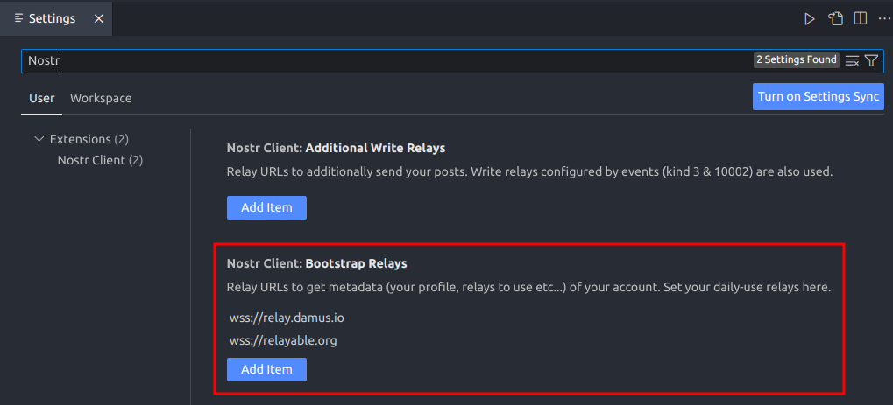

# vscode-nostr-client

A Nostr client in VSCode!

## Features

- Posting text notes
- Updating user status ([NIP-38](https://github.com/nostr-protocol/nips/blob/master/38.md))

## Usage

### 🔑 Prerequisite: Setting Private Key
First, set your Nostr private key. Open the command palette then run `Nostr: Set Private Key`. Hex key and `nsec` are supported!

### 📝 Posting Text Notes
Just run `Nostr: Post Text` command!

### 👨‍💻 Updating User Status
Run `Nostr: Update Status`, input your current status, and select the time to expiration. That's it!

With `Nostr: Update Status with Link`, you can also update your status with a link.

### 🧭 Setting Bootstrap Relays and Sync-ing Account Metadata
If posting notes doesn't seem to work, you may want to setup "bootstrap relays", from which your account metadata (e.g. relays to write) are fetched.

1. Open user settings.
2. Type "nostr" in the search box and find out the configuration item `Nostr Client: Bootstrap Relays`.
3. Click [Add item] and input relay URLs you are using.

Don't forget to run `Nostr: Synchronize Account Metadata` to update metadata after setting bootstrap relays!

## Notes
- This extension uses `vscode.SecretStorage` to store your private key. It is encrypted and finally stored in OS keyring. However, **it is not guaranteed that stored key won't be peeked by other (malicious) extension**. Please keep in mind that, and use this extension at your own risk.

## Credits
- The extension icon is based on [this awesome work](https://github.com/mbarulli/nostr-logo/) by [Andrea Nicolini](https://dribbble.com/Bembureda).
